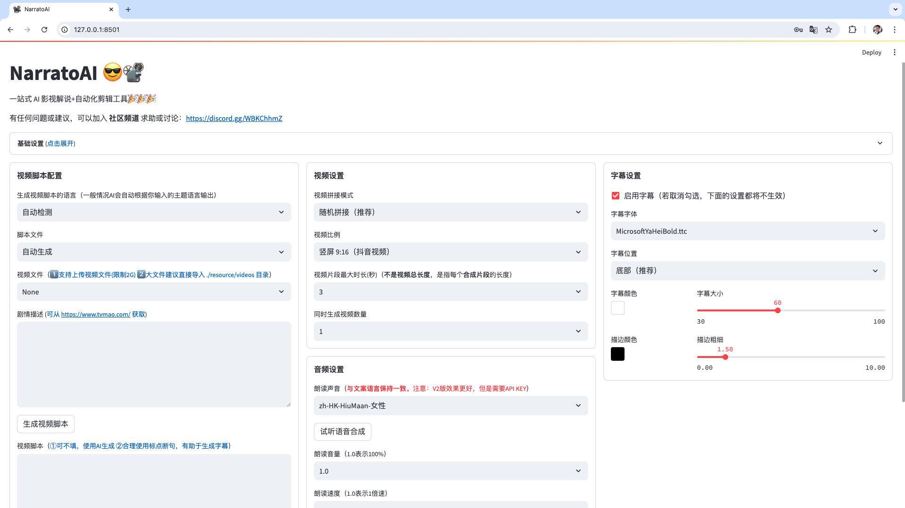
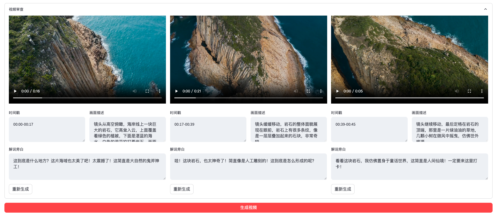

<h1 align="center" style="font-size: 2cm;"> NarratoAI 😎📽️ </h1>
<h3 align="center">一体型AI映画解説および自動ビデオ編集ツール🎬🎞️ </h3>

<h3>📖 <a href="README-cn.md">简体中文</a> | <a href="README.md">English</a> | 日本語 </h3>

[//]: # (  )

 
NarratoAIは、LLMを活用してスクリプト作成、自動ビデオ編集、ナレーション、字幕生成の一体型ソリューションを提供する自動化ビデオナレーションツールです。
 

<a href="https://discord.gg/uVAJftcm" target="_blank">💬 Discordオープンソースコミュニティに参加して、プロジェクトの最新情報を入手しましょう。</a>

<h2><a href="https://p9mf6rjv3c.feishu.cn/wiki/SP8swLLZki5WRWkhuFvc2CyInDg?from=from_copylink" target="_blank">🎉🎉🎉 公式ドキュメント 🎉🎉🎉</a> </h2>
<h3>ホーム</h3>

<h3>ビデオレビューインターフェース</h3>

## 最新情報
- 2024.11.24 Discordコミュニティ開設：https://discord.gg/uVAJftcm
- 2024.11.11 オープンソースコミュニティに移行、参加を歓迎します！ [公式コミュニティに参加](https://github.com/linyqh/NarratoAI/wiki)
- 2024.11.10 公式ドキュメント公開、詳細は [公式ドキュメント](https://p9mf6rjv3c.feishu.cn/wiki/SP8swLLZki5WRWkhuFvc2CyInDg) を参照
- 2024.11.10 新バージョンv0.3.5リリース；ビデオ編集プロセスの最適化

## 今後の計画 🥳
- [x] Windows統合パックリリース
- [x] ストーリー生成プロセスの最適化、生成効果の向上
- [x] バージョン0.3.5統合パックリリース
- [ ] アリババQwen2-VL大規模モデルのビデオ理解サポート
- [ ] 短編ドラマの解説サポート
- [ ] ...

## システム要件 📦

- 推奨最低：CPU 4コア以上、メモリ8GB以上、GPUは必須ではありません
- Windows 10またはMacOS 11.0以上

## フィードバックと提案 📢

👏 1. [issue](https://github.com/linyqh/NarratoAI/issues)または[pull request](https://github.com/linyqh/NarratoAI/pulls)を提出できます

💬 2. [オープンソースコミュニティ交流グループに参加](https://github.com/linyqh/NarratoAI/wiki)

📷 3. 公式アカウント【NarratoAI助手】をフォローして最新情報を入手

## 参考プロジェクト 📚
- https://github.com/FujiwaraChoki/MoneyPrinter
- https://github.com/harry0703/MoneyPrinterTurbo

このプロジェクトは上記のプロジェクトを基にリファクタリングされ、映画解説機能が追加されました。オリジナルの作者に感謝します 🥳🥳🥳 

## 作者にコーヒーを一杯おごる ☕️

  
  

## ライセンス 📝

[`LICENSE`](LICENSE) ファイルをクリックして表示

## Star History

