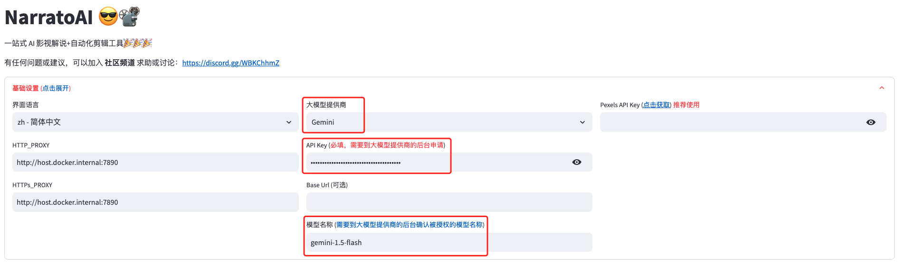
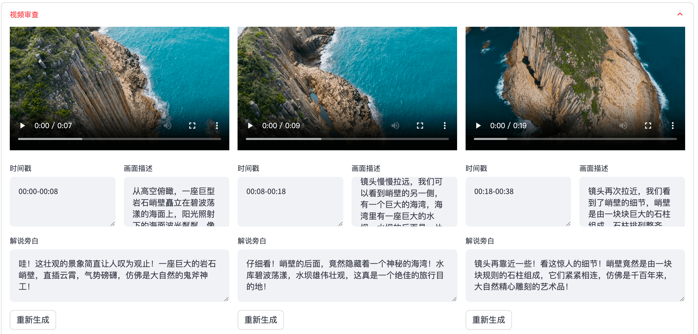
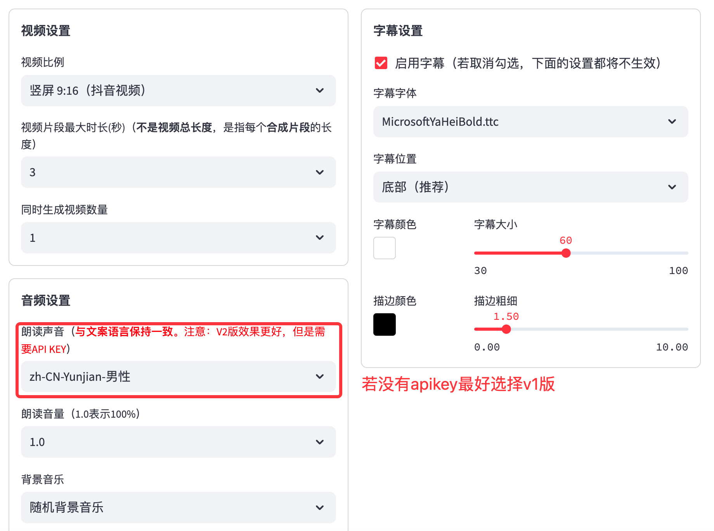

<div align="center">
<h1 align="center" style="font-size: 2cm;"> NarratoAI 😎📽️ </h1>
<h3 align="center">一站式 AI 影视解说+自动化剪辑工具🎬🎞️ </h3>


<h3>📖 <a href="README-cn.md">English</a> | 简体中文 </h3>
<div align="center">

[//]: # (  <a href="https://trendshift.io/repositories/8731" target="_blank"></a>)
</div>
<br>
NarratoAI 是一个自动化影视解说工具，基于LLM实现文案撰写、自动化视频剪辑、配音和字幕生成的一站式流程，助力高效内容创作。
<br>

[](https://github.com/linyqh/NarratoAI)
[](https://github.com/linyqh/NarratoAI/blob/main/LICENSE)
[](https://github.com/linyqh/NarratoAI/issues)
[](https://github.com/linyqh/NarratoAI/stargazers)

<a href="https://github.com/linyqh/NarratoAI/wiki" target="_blank">💬 加入开源社区，获取项目动态和最新资讯。</a>

<h2><a href="https://p9mf6rjv3c.feishu.cn/wiki/SP8swLLZki5WRWkhuFvc2CyInDg?from=from_copylink" target="_blank">🎉🎉🎉 官方文档 🎉🎉🎉</a> </h2>
<h3>首页</h3>


<h3>视频审查界面</h3>


</div>

## 最新资讯
- 2024.11.11 迁移开源社群，欢迎加入！ [加入官方社群](https://github.com/linyqh/NarratoAI/wiki)
- 2024.11.10 发布官方文档，详情参见 [官方文档](https://p9mf6rjv3c.feishu.cn/wiki/SP8swLLZki5WRWkhuFvc2CyInDg)
- 2024.11.10 发布新版本 v0.3.5；优化视频剪辑流程，

## 未来计划 🥳
- [x] windows 整合包发布
- [ ] 优化剧情生成流程，提升生成效果
- [ ] 支持本地大模型 MiniCPM-V
- [ ] 支持本地大模型 Qwen2-VL
- [ ] ...

## 配置要求 📦

- 建议最低 CPU 4核或以上，内存 8G 或以上，显卡非必须
- Windows 10 或 MacOS 11.0 以上系统

## 快速开始 🚀
### 1. 申请 Google AI studio 账号
1. 访问 https://aistudio.google.com/app/prompts/new_chat 申请账号
2. 点击 `Get API Key` 申请 API Key
3. 申请的 API Key 填入 `config.example.toml` 文件中的 `gemini_api_key` 配置

### 2. 配置 proxy VPN
> 配置vpn的方法不限，只要能正常访问 Google 网络即可，本文采用的是 chash
1. 记住 clash 服务的端口，一般为 `http://127.0.0.1:7890`
2. 若端口不为 `7890`，请修改 `docker-compose.yml` 文件中的 `VPN_PROXY_URL` 为你的代理地址
   ```yaml
   environment:
     - "VPN_PROXY_URL=http://host.docker.internal:7890" # 修改为你的代理端口；host.docker.internal表示物理机的IP
   ```
3. (可选)或者修改 `config.example.toml` 文件中的 `proxy` 配置
   ```toml
   [proxy]
    http = "http://xx.xx.xx.xx:7890"
    https = "http://xx.xx.xx.xx:7890"
   ```

### 3. 使用【整合包】开始 📥 (适用与 Windows 用户)
**NarratoAI 整合包 v0.1.2 发布啦** 🎉🎉🎉

关注微信公众号【NarratoAI助手】，回复关键词【整合包】即可获取最新下载链接！快来试试吧！

注意事项：
   - 当前仅提供 Windows 版本，Mac和Linux用户请使用 docker 启动。


### 4. 使用【docker】开始🐳 (适用与 Mac 和 Linux 用户)
#### ① 拉取项目，启动Docker
```shell
git clone https://github.com/linyqh/NarratoAI.git
cd NarratoAI
docker-compose up
```
#### ② 访问Web界面

打开浏览器，访问 http://127.0.0.1:8501

#### ③ 访问API文档

打开浏览器，访问 http://127.0.0.1:8080/docs 或者 http://127.0.0.1:8080/redoc

## 使用方法 🛠️
#### 1. 基础配置，选择模型，填入APIKey，选择模型
> 目前暂时只支持 `Gemini` 模型，其他模式待后续更新，欢迎大家提交 [PR](https://github.com/linyqh/NarratoAI/pulls)，参与开发 🎉🎉🎉
<div align="center">
  
</div>

#### 2. 选择需要解说的视频，点击生成视频脚本
> 平台内置了一个演示视频，若要使用自己的视频，将mp4文件放在 `resource/videos` 目录下，刷新浏览器即可，
> 注意：文件名随意，但文件名不能包含中文，特殊字符，空格，反斜杠等
<div align="center">
  
</div>

#### 3. 保存脚本，开始剪辑
> 保存脚本后，刷新浏览器，在脚本文件的下拉框就会有新生成的 `.json` 脚本文件，选择json文件和视频就可以开始剪辑了。
<div align="center">
  
</div>

#### 4. 检查视频，若视频存在不符合规则的片段，可以点击重新生成或者手动编辑
<div align="center">
  
</div>

#### 5. 配置视频基本参数
<div align="center">
  
</div>

#### 6. 开始生成
<div align="center">
  
</div>

#### 7. 视频生成完成
<div align="center">
  
</div>

## 开发 💻
1. 安装依赖
```shell
conda create -n narratoai python=3.11
conda activate narratoai
cd narratoai
pip install -r requirements.txt
```

2. 安装 ImageMagick
###### Windows:

- 下载 https://imagemagick.org/archive/binaries/ImageMagick-7.1.1-38-Q16-x64-static.exe
- 安装下载好的 ImageMagick，注意不要修改安装路径
- 修改 `配置文件 config.toml` 中的 `imagemagick_path` 为你的实际安装路径（一般在 `C:\Program Files\ImageMagick-7.1.1-Q16\magick.exe`）

###### MacOS:

```shell
brew install imagemagick
````

###### Ubuntu

```shell
sudo apt-get install imagemagick
```

###### CentOS

```shell
sudo yum install ImageMagick
```
3. 启动 webui
```shell
streamlit run ./webui/Main.py --browser.serverAddress=127.0.0.1 --server.enableCORS=True --browser.gatherUsageStats=False
```
4. 访问 http://127.0.0.1:8501


## 反馈建议 📢

### 👏 1. 可以提交 [issue](https://github.com/linyqh/NarratoAI/issues)或者 [pull request](https://github.com/linyqh/NarratoAI/pulls)

### 💬 2. [加入开源社区交流群](https://github.com/linyqh/NarratoAI/wiki)

### 👉 3. [常见问题](https://thread-marsupial-df8.notion.site/105866888dab80988650fa063b1df4eb)

## 参考项目 📚
- https://github.com/FujiwaraChoki/MoneyPrinter
- https://github.com/harry0703/MoneyPrinterTurbo

该项目基于以上项目重构而来，增加了影视解说功能，感谢大佬的开源精神 🥳🥳🥳 

## 请作者喝一杯咖啡 ☕️
<div style="display: flex; justify-content: space-between;">
  
  
</div>

## 许可证 📝

点击查看 [`LICENSE`](LICENSE) 文件

## Star History

[](https://star-history.com/#linyqh/NarratoAI&Date)

