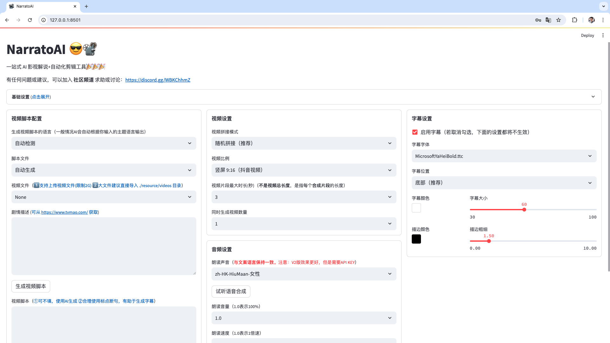

<div align="center">
<h1 align="center"> NarratoAI 😎📽️ </h1>
<h3 align="center">一站式 AI 影视解说+自动化剪辑工具🎬🎞️ </h3>

<p align="center">
  📖 <a href="README-en.md">English</a> | 简体中文 | <a href="https://www.narratoai.cn">☁️ <b>云端版入口 (NarratoAI.cn)</b></a>
</p>

<div align="center">
<br>

> **🔥 隆重推荐：VibeCut 的新范式 —— [speclip.com](https://speclip.com)**
>
> **一个真正意义上的视频剪辑 Agent！像聊天(vibecoding)一样剪辑视频。**
> **[👉 点击立即免费下载 Speclip](https://speclip.com)**

</div>

<br>

NarratoAI 是一款自动化影视解说工具，基于 LLM 实现文案撰写、自动化视频剪辑、配音和字幕生成的一站式流程，助力高效内容创作。支持本地部署开源版及 [云端托管版](https://www.narratoai.cn)。

<br>

 [](https://github.com/linyqh/NarratoAI/stargazers) [](https://github.com/linyqh/NarratoAI/issues) [](https://github.com/linyqh/NarratoAI)

<br>

<a href="https://github.com/linyqh/NarratoAI/wiki" target="_blank">💬 加入开源社群，获取项目动态和最新资讯</a>

<br>

<h2><a href="https://p9mf6rjv3c.feishu.cn/wiki/SP8swLLZki5WRWkhuFvc2CyInDg?from=from_copylink" target="_blank">🎉🎉🎉 官方文档 🎉🎉🎉</a> </h2>

### 界面预览



</div>
## 许可证
本项目仅供学习和研究使用，不得商用。如需商业授权，请联系作者。

## 最新资讯
- 2026.04.27 发布新版本 0.7.9，新增 **Fun-ASR一键转录字幕**
- 2026.04.03 发布新版本 0.7.8，重构纪录片逐帧分析链路，统一共享服务并优化抽帧、缓存、视觉并发与文案生成流程
- 2026.03.27 发布新版本 0.7.7，出于安全考虑，已移除 LiteLLM 依赖，统一使用 OpenAI 兼容请求链路
- 2025.11.20 发布新版本 0.7.5，新增 [IndexTTS-1.5](https://github.com/index-tts/index-tts) 语音克隆支持
- 2025.10.15 发布新版本 0.7.3，升级大模型供应商管理能力
- 2025.09.10 发布新版本 0.7.2，新增腾讯云tts
- 2025.08.18 发布新版本 0.7.1，支持 **语音克隆** 和 最新大模型
- 2025.05.11 发布新版本 0.6.0，支持 **短剧解说** 和 优化剪辑流程
- 2025.03.06 发布新版本 0.5.2，支持 DeepSeek R1 和 DeepSeek V3 模型进行短剧混剪
- 2024.12.16 发布新版本 0.3.9，支持阿里 Qwen2-VL 模型理解视频；支持短剧混剪
- 2024.11.24 开通 discord 社群：https://discord.com/invite/V2pbAqqQNb
- 2024.11.11 迁移开源社群，欢迎加入！ [加入官方社群](https://github.com/linyqh/NarratoAI/wiki)
- 2024.11.10 发布官方文档，详情参见 [官方文档](https://p9mf6rjv3c.feishu.cn/wiki/SP8swLLZki5WRWkhuFvc2CyInDg)
- 2024.11.10 发布新版本 v0.3.5；优化视频剪辑流程，

## 重磅福利 🎉

> 即日起全面支持硅基流动！注册即享2000万免费Token（价值16元平台配额），剪辑10分钟视频仅需0.1元！  
> 
> 🔥 快速领福利：  
> 1️⃣ 点击链接注册：https://cloud.siliconflow.cn/i/MI9PgHwB  
> 2️⃣ 使用手机号登录，**务必填写邀请码：MI9PgHwB**  
> 3️⃣ 领取16元配额，极速体验高性价比AI剪辑  
> 
> 💡 小成本大创作：  
> 硅基流动API Key一键接入，智能剪辑效率翻倍！  
> （注：邀请码为福利领取唯一凭证，注册后自动到账）  
> 
> 立即行动，用「MI9PgHwB」解锁你的AI生产力！


## ⚠️谨防被骗 📢

_**1. NarratoAI 是一款完全免费的软件，近期在社交媒体(抖音,B站等)上发现，有人将 NarratoAI 改名后售卖，下面是部分截图，请大家务必提高警惕，切勿上当受骗**_

---

<div style="display: flex; flex-wrap: wrap; justify-content: space-around; align-items: flex-start; gap: 10px;">
  
  
  
  
</div>

---

## 未来计划 🥳
- [x] windows 整合包发布
- [x] 优化剧情生成流程，提升生成效果
- [x] 发布 0.3.5 整合包
- [x] 支持阿里 Qwen2-VL 大模型理解视频
- [x] 支持短剧混剪
  - [x] 一键合并素材
  - [x] 一键转录
  - [x] 一键清理缓存
- [x] 支持导出剪映草稿
- [X] 支持短剧解说
- [ ] 主角人脸匹配
- [ ] 支持根据口播，文案，视频素材自动匹配
- [ ] 支持更多 TTS 引擎
- [ ] ...

## 快速启动 🚀

### 方式一：macos Docker 部署（macos 推荐）
```bash
# 1. 克隆项目
git clone https://github.com/linyqh/NarratoAI.git
cd NarratoAI

# 2. 一键部署
docker compose up -d

# 3. 访问应用
# 浏览器打开 http://localhost:8501
```
### 方式二：整合包（Windows 推荐）
> *关注微信公众号 **NarratoAI 助手** 右下角菜单栏获取下载链接*

### 方式三：本地运行
```bash
# 1. 克隆项目
git clone https://github.com/linyqh/NarratoAI.git
cd NarratoAI

# 2. 安装依赖
pip install -r requirements.txt

# 3. 复制配置文件
cp config.example.toml config.toml

# 4. 编辑 config.toml，配置你的 API 密钥

# 5. 启动应用
streamlit run webui.py --server.maxUploadSize=2048

# 6. 访问应用
# 浏览器打开 http://localhost:8501
```

## 配置要求 📦

- 建议最低 CPU 4核或以上，内存 8G 或以上，显卡非必须
- Windows 10/11 或 MacOS 11.0 以上系统
- [Python 3.12+](https://www.python.org/downloads/)

## 反馈建议 📢

👏 1. 可以提交 [issue](https://github.com/linyqh/NarratoAI/issues)或者 [pull request](https://github.com/linyqh/NarratoAI/pulls)

💬 2. [加入开源社区交流群](https://github.com/linyqh/NarratoAI/wiki)

📷 3. 关注公众号【NarratoAI助手】，掌握最新资讯

## 参考项目 📚
- https://github.com/FujiwaraChoki/MoneyPrinter
- https://github.com/harry0703/MoneyPrinterTurbo

该项目基于以上项目重构而来，增加了影视解说功能，感谢大佬的开源精神 🥳🥳🥳 

## 请作者喝一杯咖啡 ☕️
<div style="display: flex; justify-content: space-between;">
  
  
</div>

## 赞助
<a href="https://dartnode.com">
  
</a>

## 许可证 📝

点击查看 [`LICENSE`](LICENSE) 文件

## Star History

[](https://star-history.com/#linyqh/NarratoAI&Date)
