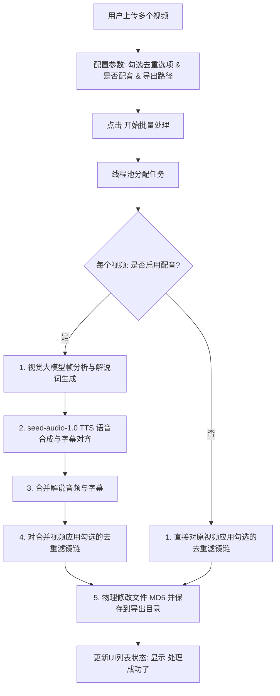

# 批量傻瓜式视频去重与AI解说方案设计（防抖音搬运检测）

## 1. 业务背景与用户痛点
在短视频分发中，防搬运检测的核心在于改变视频的物理和视觉特征，避免被平台判定为重复内容。
为了提供极简、高效率的操作体验，本项目设计了一个**傻瓜式单页面批量处理工具**。用户只需上传多个视频，配置输出目录、线程数与去重开关，即可一键完成批量去重与AI自动解读配音（TTS）。

---

### 1.1 核心 AI 模型与 API 定义
为了实现智能视频内容理解与高自然度台湾/普通话口音解说配音，系统在后台集成了字节跳动及火山引擎提供的核心多模态大模型与语音模型：

#### 1.1.1 视频内容多模态分析模型
* **接口服务商**：火山引擎大模型服务平台 (Volcano Engine Ark API)
* **模型名称**：`doubao-seed-2-1-turbo-260628`
* **API 地址**：`https://ark.cn-beijing.volces.com/api/v3/chat/completions`
* **请求头**：
  * `Content-Type: application/json`
  * `Authorization: Bearer <your_api_key>`
* **功能作用**：提取视频关键帧并转换为 Base64 编码，批量投递至该视觉多模态大模型，智能识别视频帧的主体、场景与动作，自动输出高度相关的场景描述和影视剧情大纲，从而自动生成富有吸引力的解说文案。

#### 1.1.2 语音解说合成 (TTS) 模型
* **接口服务商**：字节跳动 OpenSpeech 语音合成服务
* **模型名称**：`seed-audio-1.0`
* **API 地址**：`https://openspeech.bytedance.com/api/v3/tts/create`
* **请求头**：
  * `Content-Type: application/json`
  * `X-Api-Key: <your_api_key>`
* **功能作用**：根据生成的解说文案（可以包含多角色台词、情感 prompt、语气助词等），调用字节跳动最新一代 `seed-audio-1.0` 语音大模型，利用克隆或特定音色（如中青年男性严肃语气、台湾口音、沙哑成熟口音等），合成高保真（48000Hz）的影视解说音频，支持极富表现力的宿命感、紧张悬疑感语气输出。

---

## 2. 傻瓜式单页面交互设计 (Single Page UI)
在 WebUI 中新增一个独立的操作页面或主页 Tab，名为 **“极速批量去重与AI解说”**。页面结构紧凑，所有功能在一页内解决：

1. **视频上传区**：
   * 支持多视频上传（拖拽或选择），限制格式如 `.mp4, .mov`。
   * **上传状态展示**：实时显示当前已上传的**视频数量**以及**视频列表**。
2. **AI解说配音配置**：
   * **“启用AI解说配音”**（勾选框）：
     * 勾选时：系统将调用上述 `doubao-seed-2-1-turbo-260628` 多模态视觉模型分析视频帧内容，自动生成解说词，再通过 `seed-audio-1.0` TTS 引擎转为语音，并与视频对齐压入字幕。
     * 不勾选时：直接对原视频应用去重效果，保留视频原声，不生成额外解说。
3. **去重参数勾选区（勾选即启用，不勾选即不用）**：
   * **修改 MD5 哈希**：在视频尾部追加随机二进制字节，改变物理哈希。
   * **重新编码视频**：强制对视频流重新编码，微调码率与 GOP。
   * **随机微调画面参数 (Color/Noise Tweak)**：随机调整亮度、对比度、饱和度，并添加肉眼不可见的微量椒盐噪点。
   * **添加随机边框 (Borders)**：支持“模糊背景”或“纯色边框”。
   * **添加随机画贴 (Stickers)**：在画面角落或非主体区随机叠加透明贴图。
   * **字幕蒙版/遮罩 (Mask)**：在原视频自带字幕的固定区域增加柔化遮罩。
   * **随机画面微调 (镜像/裁剪/缩放)**（新增）：随机决定是否对画面进行轻微裁剪（0.5% - 1.5%）或水平镜像翻转，扰乱像素矩阵。
   * **随机播放速率 (Speed Tweak)**（新增）：在 0.99x - 1.01x 之间微调视频播放速度，打破原版视频帧率与音频指纹。
4. **输出与系统设置**：
   * **导出目录配置**：指定合成视频的本地保存路径。
   * **线程数量配置**：滑块或输入框，控制并行处理的视频数。
5. **执行控制区**：
   * **“开始批量处理”**（按钮）：一键启动任务，展示批量处理进度条。
   * **处理成功展示**：每个视频处理完毕后，在列表上标记“处理成功了”，并提供最终视频路径。

---

## 3. 去重与防搬运处理技术矩阵

为保证去重效果，系统内置以下处理模块：

| 去重手段 | 滤镜 / 参数实现原理 | 防检测目的 |
| :--- | :--- | :--- |
| **物理 MD5 篡改** | 读取文件流，在 EOF（文件末尾）追加随机 16~64 字节 | 彻底击穿文件哈希比对（MD5/SHA1） |
| **画面参数微调** | FFmpeg 滤镜 `eq=brightness=B:contrast=C:saturation=S`，每次随机微变 | 破坏全局像素直方图比对 |
| **画面椒盐噪点** | FFmpeg 滤镜 `noise=alls=2:allf=t+u`（微弱噪点） | 干扰平台帧指纹分析器 |
| **随机边框** | FFmpeg 滤镜 `pad`（纯色）或 `split` + `boxblur` + `overlay`（模糊背景） | 改变整体画幅宽高比和边缘像素指纹 |
| **随机卡贴** | 从 `resource/stickers` 提取 PNG 并通过 `overlay` 在随机位置以随机透明度叠加 | 破坏静态画面识别，掩盖关键像素点 |
| **字幕蒙版** | 遮罩覆盖视频底部字幕区域，通过 `boxblur` 弱化原视频字幕 | 防止原视频硬字幕与平台自带OCR文字重合被识别为重复 |
| **微量缩放与随机裁剪** | FFmpeg 滤镜 `crop=iw*0.99:ih*0.99` 并在中心微调 | 改变画面边缘位置，规避画面位置匹配 |
| **水平镜像翻转** | 随机对视频画面应用 `hflip` 滤镜 | 对抗画面左右结构的对称比对 |
| **微变播放速率** | 对视频执行 `setpts=0.99*PTS` 或 `1.01*PTS`，音频执行 `atempo` 对应调整 | 破坏音频和视频流的时域哈希，彻底打破帧率特征 |

---

## 4. 单页面处理工作流引擎


---

## 5. 交互界面设计草图 (Streamlit UI Grid)
* **顶部标题**：显示大标题与简短说明。
* **左侧控制栏 (配置区)**：
  * 设置导出目录输入框 (Text Input)。
  * 设置并发线程数 (Slider / Selectbox)。
  * 开关：是否启用 AI 自动解说配音 (Checkbox)。
  * 折叠菜单：去重功能勾选（MD5、重新编码、画面微调、随机边框、画贴、蒙版、画面镜像、速度微调等）。
* **右侧主栏 (文件与执行区)**：
  * 文件上传器 (Multiple File Uploader)。
  * 上传统计：显示“当前已上传 N 个视频”。
  * 视频列表状态表 (表格/列显示：视频名称，当前状态，最终路径)。
  * **一键处理按钮** (Button: 开始处理)。
  * 进度展示与“处理成功了”成功状态弹窗。

---

## 6. 开发人员分工与协作模型

为了实现该批量傻瓜式去重解说工具的敏捷开发，推荐将工作拆分为两个相互独立的角色：**开发人员 A (前端交互与多线程调度)** 与 **开发人员 B (核心视频去重滤镜与模型接口)**。

### 6.1 开发人员 A：前端页面交互与任务调度模块
主要负责构建面向用户的“极速批量去重与AI解说”傻瓜化 Tab 页，以及控制多线程的异步批处理。
* **文件范围**：
  * `webui.py`（主界面）：新增 Tab，渲染多文件上传器、上传视频状态表（显示各视频文件名，当前状态“等待中/处理中/处理成功了/失败”，及最终成品视频播放/下载路径），配置去重选项。
  * `app/services/batch_processor.py` [NEW]：编写批量处理的逻辑调度器，建立线程池（`ThreadPoolExecutor`），在后台分发每个视频的处理任务。
  * `webui/i18n/zh.json` & `en.json`：新增相关界面中文/英文语言翻译词条。
* **开发职责**：
  * 实现上传视频数量统计与展示。
  * 线程数滑块及导出文件夹输入的输入校验。
  * 在点击“开始批量处理”后，触发线程池分配，并为每个任务向前端回传处理进度。

---

### 6.2 开发人员 B：核心视频去重滤镜与模型接口
主要负责底层音视频处理的滤镜参数链装配、物理 MD5 修改器、以及大模型 API 的请求与处理。
* **文件范围**：
  * `app/models/schema.py`：扩展 `VideoClipParams`，增加全部去重开关与配置属性字段。
  * `app/services/generate_video.py`：
    1. 实现 `apply_direct_deduplication()` 直接去重命令行工具。
    2. 实现 `modify_file_md5()`，在文件末尾以二进制流形式写入随机字节改变 MD5 值。
    3. 扩充 FFmpeg 滤镜逻辑：实现画面微量裁剪缩放、水平翻转镜像、画面 eq（亮度/对比度/噪声）微调、边框（模糊/纯色）、卡贴贴纸覆盖、微变播放速率与音频伴音同步变速。
  * `app/services/documentary/frame_analysis_service.py`：适配 Volcano Engine 视觉接口 `doubao-seed-2-1-turbo-260628`。
  * `app/services/voice.py`：对接 `seed-audio-1.0` 的大模型合成接口。
* **开发职责**：
  * 确保不论是通过 AI 解说粗剪合并，还是直接去重，输出文件的 MD5 值都是完全独立的。
  * 负责编写和验证去重滤镜算法的 FFmpeg 命令行拼接正确性，确保转码不出错，视频能正常流畅播放。

---

### 6.3 对接契约与协作流程
1. **接口协议**：
   * 在去重不配音的流程中，开发人员 A 将直接调用开发人员 B 暴露的方法：
     ```python
     def apply_direct_deduplication(input_path: str, output_path: str, params: VideoClipParams) -> bool:
         # 由开发人员 B 实现 FFmpeg 的滤镜执行与转码
     ```
   * 在启用配音的流程中，开发人员 A 会直接实例化 `VideoClipParams` 并调用 `start_subclip_unified` 流程。开发人员 B 需确保去重滤镜在此主流程的最后合并步骤成功挂接。
2. **集成顺序**：
   * 成员 B 完成 schema 与 `generate_video.py` 后提交。
   * 成员 A 引入相关参数及方法，并在 `webui.py` 和 `batch_processor.py` 中连调。

